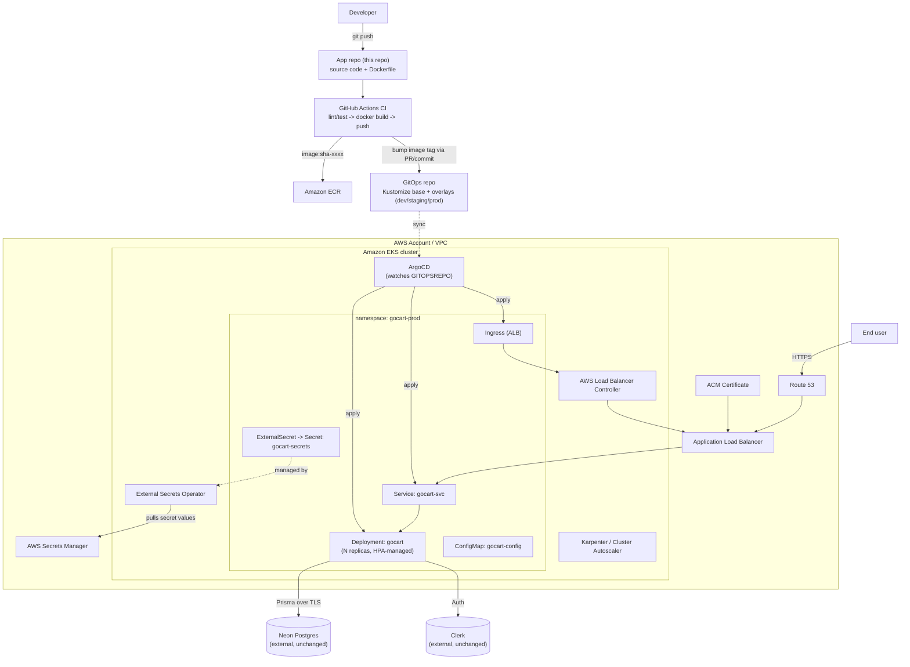

# GoCart — Production Readiness & EKS/ArgoCD GitOps Migration Plan

**Status:** Draft — for review
**Owner:** DevOps (gauravsumeet)
**Current state:** App runs in a 3-node `kind` cluster inside Docker, on a single EC2 instance, deployed by running `scripts/deploy.sh` by hand. See `README.md` for that architecture.
**Target state:** App runs on managed **Amazon EKS**, deployed and kept in sync entirely through **ArgoCD GitOps** — no human ever runs `kubectl apply` or `docker build` against production again.

---

## 1. Goals

1. Replace the single-EC2/`kind` demo cluster with a real, managed, multi-AZ **Amazon EKS** cluster.
2. Replace the imperative `scripts/deploy.sh` workflow with **declarative GitOps**: the desired state of the cluster lives in Git, and **ArgoCD** continuously reconciles the live cluster to match it.
3. Close the production-readiness gaps the current demo setup deliberately skipped (fixed replica count, no autoscaling, no TLS, no real secret management, no CI, no observability).
4. Do this in safe, independently-shippable phases, so the existing EC2/`kind` setup keeps working until the EKS path is proven.

## 2. Non-goals (for this plan)

- Rewriting application code or changing the data model.
- Choosing a service mesh (Istio/Linkerd) — out of scope unless a concrete need (mTLS between services, traffic shifting) emerges later.
- Multi-region / multi-cluster active-active — this plan targets a single-region, single-cluster production setup with room to grow into that later.

---

## 3. Gap Analysis — current demo vs. production target

| Area | Today (EC2 + `kind`) | Target (EKS + ArgoCD) |
|---|---|---|
| **Cluster** | 3 Docker-in-Docker nodes on 1 EC2 instance; dies if that instance dies | Managed EKS control plane (AWS-operated, multi-AZ) + managed/Karpenter-provisioned worker nodes across 2–3 AZs |
| **Deployment trigger** | Human SSHs in and runs `./scripts/deploy.sh` | Git push/merge → CI builds image → GitOps repo updated → ArgoCD auto-syncs |
| **Image registry** | `kind load docker-image` (local only, no registry) | Amazon **ECR**, with vulnerability scanning on push |
| **Manifests** | Static YAML in `k8s/`, `sed`-patched image tag | **Kustomize** overlays (`base/` + `overlays/dev,staging,prod`) rendered/synced by ArgoCD |
| **Secrets** | `kubectl create secret` run by hand from local `.env` | **AWS Secrets Manager** + **External Secrets Operator**, nothing secret ever touches Git or a human's shell |
| **Ingress/TLS** | `ingress-nginx`, HTTP only, `ssl-redirect: false` | **AWS Load Balancer Controller** (ALB) + **ACM** cert, HTTPS enforced, DNS via **Route 53** |
| **Scaling** | Fixed 2 replicas, no node autoscaling | **HPA** on CPU/memory (+ custom metrics later), **Karpenter** for node autoscaling |
| **Availability** | Single EC2 instance = single point of failure | Multi-AZ nodes, `PodDisruptionBudget`, topology spread constraints |
| **Observability** | `kubectl logs`, `audit.sh` script | **CloudWatch Container Insights** (or Prometheus/Grafana) + alerting, structured app logs |
| **Security posture** | Non-root container (good, keep it), but no network policy, no image scanning, broad IAM | Pod Security Standards (`restricted`), `NetworkPolicy`, ECR image scanning, least-privilege **IRSA** per workload |
| **Rollback** | `kubectl rollout undo` by hand | `git revert` on the GitOps repo → ArgoCD auto-reverts the cluster; optionally Argo Rollouts for canary/automated rollback |
| **Database** | Neon serverless Postgres (external, already production-grade) | **Keep Neon** — see Decision D1 below |

---

## 4. Target architecture



Key shift: **Git is the only interface to production.** Nobody runs `kubectl apply` against the prod cluster by hand; ArgoCD is the only writer.

---

## 5. Key decisions (need sign-off before Phase 2 starts)

| ID | Decision | Recommendation | Rationale |
|---|---|---|---|
| **D1** | Keep Neon Postgres, or migrate to Amazon RDS/Aurora? | **Keep Neon** | Neon is already a managed, production-grade, serverless Postgres with its own HA/backups. Migrating to RDS adds VPC networking (private subnets, security groups, RDS Proxy) and a data migration project for no clear win. Revisit only if there's a hard requirement to keep all data inside the VPC/AWS account. |
| **D2** | One GitOps repo, or a folder in this repo? | **Separate repo** (e.g. `gocart-gitops`) | Keeps application code changes (which trigger CI) decoupled from deployment-state changes (which trigger ArgoCD sync) — standard GitOps hygiene, and lets ArgoCD's RBAC be scoped to a repo that contains no app source. |
| **D3** | Kustomize or Helm for manifests? | **Kustomize** | The existing `k8s/*.yaml` are already plain manifests; Kustomize overlays (`base` + per-env patches) are the smallest step up and avoid introducing templating language. Revisit if a public Helm chart would otherwise need to be hand-rolled (e.g. for a 3rd-party add-on). |
| **D4** | Node compute: managed node group or Karpenter? | **Karpenter** | Faster, more cost-efficient bin-packing and scale-to-zero for non-prod; one more moving part to learn, but it's becoming the EKS-standard autoscaler. Fallback: a single managed node group if the team wants to defer that learning curve. |
| **D5** | How many environments? | **dev, staging, prod** — one EKS cluster, three namespaces (cost-efficient) initially; split into per-env clusters later only if blast-radius isolation becomes a real requirement. | Matches team size/scope implied by this repo; avoids paying for 3 control planes on day one. |
| **D6** | Observability stack | **CloudWatch Container Insights** to start | Zero extra infrastructure to run, pay-as-you-go. Revisit Prometheus/Grafana (via `kube-prometheus-stack`) if richer dashboards/alerting rules are needed later. |

---

## 6. Phased implementation plan

Each phase should land as its own PR(s) and be independently verifiable. The existing EC2/`kind` setup stays live and untouched until Phase 9 (cutover).

### Phase 0 — Prerequisites & access
- AWS account + billing alarm set up; target region chosen (e.g. `ap-south-1` or `us-east-1`).
- Domain/subdomain available for Route 53 (e.g. `gocart.<yourdomain>`).
- IAM identity for Terraform (a dedicated deploy role, not a personal root/admin user).
- A dedicated GitHub repo created for GitOps manifests (`gocart-gitops`), and an ECR repo for the image.
- Decisions D1–D6 above signed off.

### Phase 1 — Application production-readiness hardening
*(No infra yet — just makes the app itself ready for a real production cluster.)*
- Add a `HorizontalPodAutoscaler` (target CPU/memory) instead of a fixed `replicas: 2`.
- Add a `PodDisruptionBudget` (`minAvailable: 1`) so node drains/upgrades can't take the app fully down.
- Add `topologySpreadConstraints` so the 2+ replicas land on different AZs/nodes.
- Confirm graceful shutdown: Next.js standalone server should handle `SIGTERM` within the pod's `terminationGracePeriodSeconds`; add an explicit value and verify in-flight requests drain.
- Review/tighten `resources.requests/limits` using real load-test numbers instead of the current placeholder values.
- Add a `securityContext` (`runAsNonRoot: true`, `readOnlyRootFilesystem` where feasible, drop all Linux capabilities) — the image already runs as non-root `nextjs`, this makes it explicit and enforced at the pod level.
- Add structured JSON logging (or confirm Next.js's default stdout logs are parseable) so CloudWatch/Container Insights can index them usefully.

### Phase 2 — AWS foundation (Terraform)
New `infra/` directory (Terraform), state in an S3 backend + DynamoDB lock table:
- VPC: public + private subnets across 3 AZs, NAT gateway(s).
- EKS cluster (control plane) in the private subnets.
- OIDC provider for the cluster (required for IRSA).
- ECR repository for the `gocart` image, with scan-on-push enabled.
- Base IAM roles: cluster admin role, a CI deploy role (push-to-ECR + nothing else), per-workload IRSA roles added as needed in later phases.
- Route 53 hosted zone (or delegate from existing DNS) + ACM certificate request (DNS-validated).

**Verification:** `kubectl get nodes` against the new cluster from an authorized operator machine; nothing application-specific deployed yet.

### Phase 3 — Cluster add-ons (bootstrapped via Terraform/Helm, not yet ArgoCD)
Installed once per cluster, before ArgoCD takes over app delivery:
- **AWS Load Balancer Controller** (so `Ingress` objects provision real ALBs).
- **External Secrets Operator** (so secrets can be pulled from AWS Secrets Manager into K8s `Secret`s).
- **Karpenter** (or a managed node group, per D4) for node autoscaling.
- **metrics-server** (required for HPA to function).
- **CloudWatch Container Insights** agent (per D6).
- Optionally `cert-manager` — not required if ACM+ALB handles TLS termination (recommended default), only needed if a future ingress wants Let's-Encrypt-style certs.

### Phase 4 — Install ArgoCD
- Install ArgoCD itself into the cluster (Helm chart, or the official install manifests) — this one installation step can stay a one-time, documented manual/Terraform-Helm-provider action, since ArgoCD can't GitOps-manage its own initial install.
- Configure ArgoCD to authenticate to the `gocart-gitops` repo (deploy key or GitHub App).
- Set up ArgoCD RBAC: who can see/sync which `AppProject`.
- Expose the ArgoCD UI internally (e.g. behind the same ALB + an internal-only path, or via `kubectl port-forward` for now) — do **not** expose it publicly without SSO.

### Phase 5 — GitOps repo structure & first sync
In `gocart-gitops`:
```
gocart-gitops/
├── apps/
│   └── gocart.yaml              # ArgoCD Application (or ApplicationSet) definition
├── base/
│   ├── namespace.yaml
│   ├── deployment.yaml
│   ├── service.yaml
│   ├── ingress.yaml
│   ├── hpa.yaml
│   ├── pdb.yaml
│   ├── externalsecret.yaml
│   └── kustomization.yaml
└── overlays/
    ├── dev/        (patches: lower resources, 1 replica, dev.gocart.<domain>)
    ├── staging/    (patches: prod-like resources, staging.gocart.<domain>)
    └── prod/       (patches: HPA min/max, prod.gocart.<domain> or gocart.<domain>)
```
- Create one ArgoCD `Application` per environment (or a single `ApplicationSet` generating all three from the `overlays/*` directories) pointing at this repo.
- First sync target: **dev** namespace only. Prove the loop — merge a manifest change, watch ArgoCD pick it up and reconcile — before touching staging/prod.

### Phase 6 — CI pipeline (GitHub Actions)
In this app repo, `.github/workflows/ci.yml`:
1. On push/PR: `npm ci`, `npm run lint`, `npm run build` (catches build breaks before they ever reach an image).
2. On merge to `main`: `docker build` (same multi-stage `Dockerfile`, same `NEXT_PUBLIC_*` build args sourced from GitHub Actions secrets) → tag as `ghcr`/ECR `<git-sha>` → `docker push` to ECR.
3. Final step: open a PR (or push directly, for dev) against `gocart-gitops` that bumps the image tag in `overlays/<env>/kustomization.yaml` — either via a small script/`yq`, or using **Argo CD Image Updater** to remove this step entirely and have ArgoCD detect new ECR tags itself.
- Add a required status check on the app repo's `main` branch so nothing unbuildable can trigger a deploy.

### Phase 7 — Secrets management cutover
- Create the real secrets (`DATABASE_URL`, `DIRECT_URL`, `CLERK_SECRET_KEY`) in **AWS Secrets Manager**, scoped per environment (`gocart/dev/...`, `gocart/prod/...`).
- Replace `k8s/secret.example.yaml`'s pattern (imperative `kubectl create secret`) with an `ExternalSecret` resource in `base/` that references the Secrets Manager entry; External Secrets Operator (Phase 3) materializes the real K8s `Secret`.
- Grant the ESO pod an IRSA role scoped to `secretsmanager:GetSecretValue` on only the `gocart/*` secret ARNs — no broader AWS access.
- Result: **no human and no CI job ever holds the production secret values** — they're written once into Secrets Manager (console or `aws secretsmanager put-secret-value`) and everything downstream is pull-based.

### Phase 8 — Networking, TLS, DNS
- `Ingress` in `base/ingress.yaml` annotated for the AWS Load Balancer Controller (`alb.ingress.kubernetes.io/*`), referencing the ACM cert from Phase 2.
- Route 53 record(s): `dev.gocart.<domain>`, `staging.gocart.<domain>`, `gocart.<domain>` → ALB.
- Enforce HTTPS (redirect HTTP→HTTPS at the ALB listener) — the opposite of today's `ssl-redirect: "false"` demo setting.
- (Optional, later) AWS WAF attached to the ALB for basic bot/rate-limit protection on the public prod listener.

### Phase 9 — Observability & alerting
- Confirm Container Insights is capturing pod logs + cluster/node metrics.
- Build a minimal CloudWatch dashboard: request rate/latency (from ALB access logs/target group metrics), pod CPU/memory, pod restart count.
- Alarms: pod crash-looping, HPA maxed out for >N minutes, ALB 5xx rate, ArgoCD `OutOfSync`/`Degraded` app health (ArgoCD Notifications can post this to Slack/email).
- `/api/health` keeps serving as the liveness/readiness source of truth — extend it later to check DB connectivity if deeper health signal is needed.

### Phase 10 — Security hardening pass
- Apply Pod Security Standards at the namespace level (`restricted` for `gocart-prod`).
- Add a `NetworkPolicy` default-denying ingress to the `gocart` pods except from the ALB controller's target-group health checks and the Service itself.
- Confirm ECR scan-on-push results are reviewed (or wired into CI as a gate) before an image reaches `prod`.
- Least-privilege IAM: ArgoCD's own service account, the ESO service account, and the ALB controller each get their own narrow IRSA role — never a shared "cluster admin" role for workloads.
- Rotate the Neon/Clerk credentials once (tracked separately — see the security note from the EC2 phase) as part of moving them into Secrets Manager.

### Phase 11 — Cutover & decommission of the EC2/`kind` demo
- Run dev/staging/prod on EKS in parallel with the existing EC2/`kind` deployment for a soak period.
- Point a staging DNS record at EKS first; smoke-test the full user flow (browse, cart, checkout, vendor dashboard, admin panel, Clerk auth) end-to-end.
- Cut the production DNS record over to the EKS ALB.
- Once stable, tear down the EC2 instance/`kind` cluster (`kind delete cluster`, terminate the instance) and archive `scripts/deploy.sh`, `scripts/ec2-bootstrap.sh`, `kind-cluster.yaml` as historical/demo material (keep them — they're good reference docs — but mark clearly in `README.md` that they're no longer how production is deployed).

### Phase 12 (stretch) — Progressive delivery
- Introduce **Argo Rollouts** for the prod `Application`: canary steps (e.g. 10% → 50% → 100%) with automated analysis against the CloudWatch metrics from Phase 9, and automatic rollback on failed analysis — replacing the plain `Deployment` rolling update for prod only.

---

## 7. Rough milestones

| Milestone | Phases covered | Exit criteria |
|---|---|---|
| **M1 — Foundation** | 0, 1, 2 | EKS cluster up, app hardening PRs merged, nothing deployed to EKS yet |
| **M2 — First GitOps deploy (dev)** | 3, 4, 5 | A manual image push + ArgoCD sync gets the app running in `dev` on EKS, reachable internally |
| **M3 — Full pipeline** | 6, 7 | A `git push` to `main` alone results in `dev` updating itself within minutes, secrets sourced from Secrets Manager |
| **M4 — Production-grade** | 8, 9, 10 | `staging`/`prod` live behind HTTPS + real DNS, dashboards/alerts in place, security pass complete |
| **M5 — Cutover** | 11 | Production DNS points at EKS; EC2/`kind` decommissioned |
| **M6 — Stretch** | 12 | Canary rollouts live for prod |

---

## 8. Open questions for the team

1. AWS region and account (new account vs. existing)?
2. Domain name to use for `dev`/`staging`/`prod`?
3. Who should have ArgoCD UI/API access, and via what SSO provider (GitHub OAuth is simplest if the repos already live on GitHub)?
4. Any compliance requirement that would force D1 (Neon → RDS) regardless of the recommendation above?
5. Budget ceiling — affects node sizing, whether `dev`/`staging` scale to zero overnight (Karpenter makes this easy) and whether Multi-AZ NAT gateways (cost) are needed or a single NAT is acceptable for non-prod.
